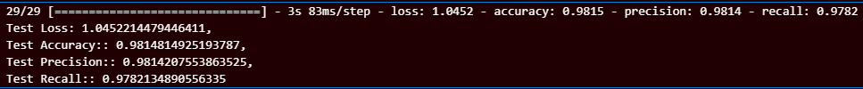
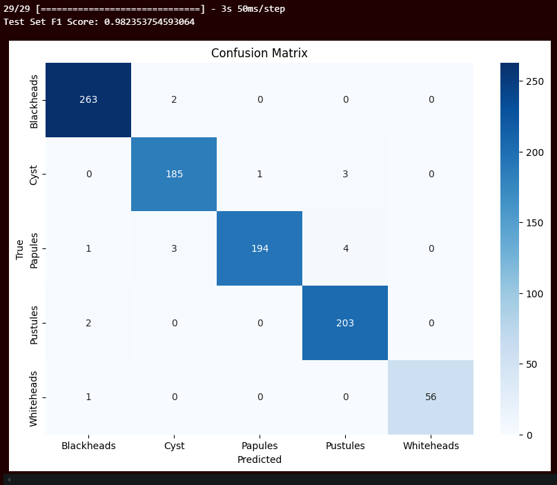

# AcneScan  

AcneScan is a machine learning-based project designed to detect different types of acne using image classification techniques. This project leverages advanced deep learning technologies to provide accurate and efficient acne classification.  

## Key Features  

- **Acne Classification**: Identifies 5 types of acne (cyst, papules, pustules, whitehead, blackhead) from facial images.  
- **Image Processing**: Preprocessing techniques to enhance image quality and improve model accuracy.  
- **Efficient Model Architecture**: Combines convolutional layers with advanced techniques to achieve high precision in acne detection.  

## Machine Learning Workflow  

1. **Data Collection**:  
   Facial images labeled with acne types are collected for training and validation. We have the dataset from kaggle. Here's the link to the dataset:
   https://www.kaggle.com/datasets/priyangshumazumder/acnedatasetbysah

3. **Preprocessing**:  
   - Resizing images to (150, 150, 3).  
   - Normalizing pixel values for faster and more stable training.
   - Using various types of image augmentation to add more data.

4. **Model Architecture**:  
   - **Transfer Learning**: Utilized EfficientNetB0 as the base model for feature extraction, pretrained on ImageNet.  
   - **Data Augmentation**: Applied transformations to enhance the diversity of the training dataset.  
   - **Global Average Pooling**: Added to reduce the spatial dimensions of feature maps from EfficientNet50.  
   - **Dense Layers**:  
     - `1024` units with ReLU activation for high-level feature learning.  
     - `512` units with ReLU activation and L2 regularization to reduce overfitting.  
   - **Batch Normalization**: Used after dense layers to normalize activations and stabilize training.  
   - **Dropout**:  
     - `0.6` after the first dense layer.  
     - `0.5` after the second dense layer to prevent overfitting.  
   - **Activation Functions**:  
     - `ReLU` for intermediate dense layers.  
     - `Softmax` for the final dense layer to classify into five acne types.  
   - **Regularization**: Applied L2 regularization in dense layers to enhance model generalization.  
 
5. **Training**:  
   - **Framework**: TensorFlow.  
   - **Optimizer**:  
     - `Adam` with the following parameters:  
       - `learning_rate`: 0.0001  
       - `beta_1`: 0.9  
       - `beta_2`: 0.999  
       - `epsilon`: 1e-07  
       - `amsgrad`: True  
   - **Loss Function**: `Categorical Crossentropy`.  
   - **Metrics**: Accuracy, Precision, Recall.  
     

6. **Evaluation**:  
   - Evaluated on validation and test datasets to measure performance.
   - Using F1 Score and Confusion Metrics to evaluate the model performance.
   - Our model accuracy is very high. It has 100% on training, 99% on validation, 98% on test F1 score.  
     
   

7. **Deployment**:  
   - Model is converted to TensorFlow Lite for integration into Android application.
   - The model was deployed to Google Cloud Platform as cloud run.  

## Tools and Libraries  

- **TensorFlow**: Core library for building, training, and optimizing the machine learning model.  
- **Scikit-learn**: For evaluating model performance using metrics like F1-score.  
- **NumPy**: For numerical computations and data manipulation.  
- **Pillow (PIL)**: For handling image input and preprocessing.  
- **Matplotlib**: For visualizing data, training progress, and results.  
- **TensorFlow Keras Modules**:  
  - `layers` and `Model`: For constructing the model architecture.  
  - `Rescaling`: For image normalization during preprocessing.  
  - `ImageDataGenerator`: For augmenting and managing image datasets.  
  - `EfficientNetB0`: Pre-trained models for transfer learning.  
- **Callbacks**:  
  - `ReduceLROnPlateau`: To dynamically adjust the learning rate during training.  
- **Metrics**:  
  - `Precision` and `Recall`: For detailed evaluation of classification performance.  

### Prerequisites  

Ensure you have Python installed (version 3.8 or higher is recommended). Install the required libraries by running the following command:  
```bash  
pip install tensorflow scikit-learn numpy pillow matplotlib  

